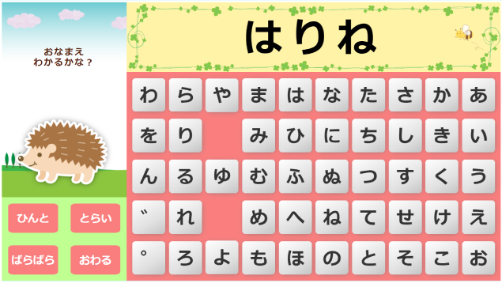
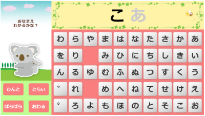
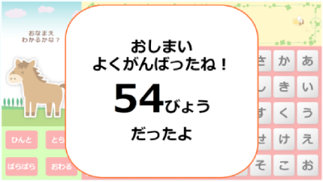
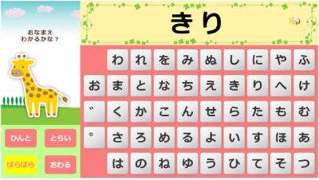
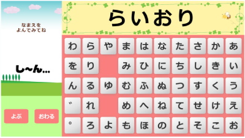
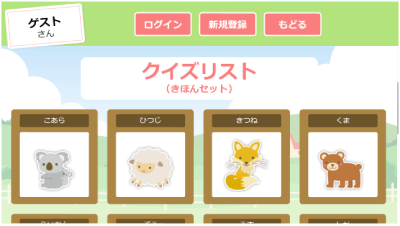

# おなまえ「あいうえお」(Vue & Firebase)

## はじめに

「おなまえ『あいうえお』」は幼児向けの「ひらがな」学習用アプリです。



表示されるイラストの名前を五十音表から入力する「くいずモード」と、
好きにひらがなを入力して入力された名前のイラストを表示する「じゆうモード」で、
遊びながら、ひらがなを学習できます。

[おなまえ「あいうえお」](https://a-i-u-e-o.web.app/)

名前とパスワードを設定してログインすると、自分でオリジナルのクイズを登録できます。  
お子さんの好きなものや親しみのある画像をクイズとして登録することで、学習効果もアップするかもしれません。


## 使用技術
・Vue  
・VueCLI  
・VueRouter  
・Vuex  
・JavaScript  
・CSS  
・Firebase  
  　-Firestore  
  　-Storage  
  　-Hosting


## 機能一覧
### トップ画面 
  

### くいずモード  
「くいずモード」では、表示されるイラストの名前を五十音表形式の入力パットで入力して答えます。間違った文字を入力すると、注意されるので、正しく入力して、正解していきましょう。
#### ・ひんと機能
「ひんと」ボタンを押すと、解答中のクイズの次の一文字が表示されるので、同じ文字を探して入力してみましょう。わからなくなって投げ出すことなくクイズに挑戦できます。  

  

#### ・とらい機能
「とらい」ボタンを押すと、10問正解するまでの時間を測定することができます。タイムトライアルで自分の記録に挑戦してモチベーションアップ！  

 

#### ・ばらばら機能
「ばらばら」ボタンを押すと、50音表の表示がバラバラになります。慣れてきたお子さんと一緒にどこだどこだと探したり、大人の脳トレにも効果ありです。  

 


### じゆうモード  
「じゆうモード」では、五十音表から好きなように文字を入力して言葉をつくることができます。  
「よぶ」ボタンを押すと、作った言葉の画像が登録されていれば、その画像が表示されます。登録されていない場合は、何も出てきてくれないので少し寂しいかも。  

 


### リスト/ログインモード  
「リスト/ログインモード」では、今登録されているクイズを確認することができます。  
また、ユーザー登録してログインすると、オリジナルのクイズを登録することも可能です。  

 

### Compiles and minifies for production
```
npm run build
```

### Lints and fixes files
```
npm run lint
```

### Customize configuration
See [Configuration Reference](https://cli.vuejs.org/config/).
